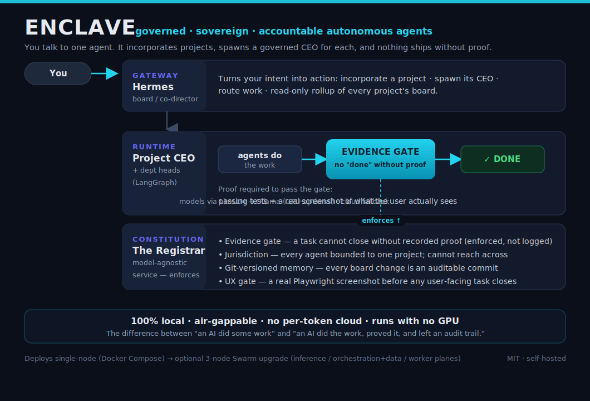

# Enclave

**Governed, sovereign, accountable AI agents — local-first. Agents cannot mark work "done" without proof.**



Enclave is a **sovereign, bounded, accountable-by-construction autonomous engineering
organization**: you talk to a gateway agent that incorporates projects and spawns governed
CEO agents whose work **cannot be marked "done" without recorded evidence** — passing tests
and a real screenshot of what a user actually sees, enforced by a separate service
(the Registrar), regardless of which model or harness runs.

Three primitives make it different from agent frameworks like MetaGPT, CrewAI or LangGraph:

**Provable completion.** An agent cannot close a task without recorded evidence. The evidence
gate is a hard, enforced service — not a convention.

**Jurisdiction.** Every deployed agent is bounded to exactly one project: its own network,
volume namespace, board scope and repo. Its tool allow-list literally lacks any way to reach
another project.

**Sovereignty.** Runs entirely on your own hardware. Air-gappable. No per-token cloud
required — the default path runs with **no GPU** via a model-fallback chain (remote free
tiers when available, local CPU/GPU inference as the floor).

> Substrate: a 32-service Docker stack (LiteLLM gateway, Hermes agent, Postgres, Redis,
> Qdrant, n8n, Open WebUI, and more). The governance is the headline; the stack is the body.
> Internally the compose project keeps the codename `aef2` — renaming it would re-namespace
> volumes/networks; brand and project name are deliberately decoupled.

**Docs:** [Governance & threat model](docs/GOVERNANCE.md) · [Candid comparison vs Paperclip/MetaGPT/CrewAI/LangGraph](docs/COMPARISON.md) · [The Registrar](registrar/README.md) · [Demo shot script](docs/DEMO-SHOT-SCRIPT.md)

[](LICENSE)
[](https://docs.docker.com/compose/)

---

## Table of Contents

1. [Architecture Overview](#architecture-overview)
2. [Prerequisites](#prerequisites)
3. [Quick Start](#quick-start)
4. [Profile System](#profile-system)
5. [Service Index](#service-index)
6. [Hermes Agent](#hermes-agent)
7. [Configuration Guide](#configuration-guide)
8. [Common Commands](#common-commands)
9. [Troubleshooting](#troubleshooting)
10. [Contributing](#contributing)

---

## Architecture Overview

```
┌─────────────────────────────────────────────────────────────────────────────┐
│                          AEF2 LOCAL AI STACK                                │
├─────────────────────────────────────────────────────────────────────────────┤
│  LAYER 1 — USER INTERFACES                                                  │
│  ┌─────────────┐  ┌─────────────┐  ┌─────────────┐  ┌────────────────────┐ │
│  │  Open WebUI │  │   AFFiNE    │  │  TriliumNext│  │  Homepage Dashboard│ │
│  │  :3000      │  │  :3010      │  │  :8190      │  │  :3030             │ │
│  └──────┬──────┘  └─────────────┘  └─────────────┘  └────────────────────┘ │
├─────────┼───────────────────────────────────────────────────────────────────┤
│  LAYER 2 — AGENT GATEWAY                                                    │
│           │                                                                 │
│  ┌────────▼────────────────────────────────────────────────────────────┐   │
│  │                    HERMES AGENT  :8642                              │   │
│  │  System Prompt · Skills · MCP Tools · Memory · Langfuse Tracing    │   │
│  └────────┬──────────────────────────────────────────────────────────┬┘   │
├───────────┼──────────────────────────────────────────────────────────┼─────┤
│  LAYER 3 — LLM ROUTING                                               │     │
│  ┌────────▼─────────────────────────┐  ┌────────────────────────────▼──┐  │
│  │  LiteLLM Proxy  :4000            │  │  MCPO Bridge  :8080            │  │
│  │  11 models · Aliases · Fallbacks │  │  MCP-to-OpenAI protocol bridge │  │
│  └────────┬─────────────────────────┘  └──────────────┬────────────────┘  │
├───────────┼────────────────────────────────────────────┼────────────────────┤
│  LAYER 4 — LOCAL LLM ENGINE                           │ LAYER 5 — MCP TOOLS│
│  ┌────────▼──────────────────────┐  ┌─────────────────▼──────────────────┐ │
│  │  Ollama  :11434               │  │  7 MCP Servers  :3701-3707         │ │
│  │  llama3.2 · dolphin3          │  │  filesystem · memory · fetch       │ │
│  │  deepseek-r1 · nomic-embed    │  │  github · postgres · surreal · dock│ │
│  └───────────────────────────────┘  └────────────────────────────────────┘ │
├─────────────────────────────────────────────────────────────────────────────┤
│  LAYER 6 — AUTOMATION & WORKFLOWS                                           │
│  ┌─────────────────┐  ┌────────────────┐  ┌──────────────┐                 │
│  │  n8n  :5678     │  │  Flowise :3100 │  │  SearXNG:8081│                 │
│  │  workflow engine│  │  LLM pipelines │  │  private web │                 │
│  └─────────────────┘  └────────────────┘  └──────────────┘                 │
├─────────────────────────────────────────────────────────────────────────────┤
│  LAYER 7 — KNOWLEDGE & MEMORY                                               │
│  ┌──────────────┐  ┌────────────────┐  ┌─────────────┐  ┌───────────────┐  │
│  │  AnythingLLM │  │  Mem0  :8888   │  │  Docling    │  │  Open Interp  │  │
│  │  :3200       │  │  memory store  │  │  :5001 OCR  │  │  :8143        │  │
│  └──────────────┘  └────────────────┘  └─────────────┘  └───────────────┘  │
├─────────────────────────────────────────────────────────────────────────────┤
│  LAYER 8 — VECTOR STORES                                                    │
│  ┌────────────────┐  ┌──────────────┐  ┌───────────────────────────────┐   │
│  │  Qdrant :6333  │  │  ChromaDB    │  │  Weaviate  :8280               │   │
│  │  PRIMARY STORE │  │  :8200 (dev) │  │  hybrid vector+keyword search  │   │
│  └────────────────┘  └──────────────┘  └───────────────────────────────┘   │
├─────────────────────────────────────────────────────────────────────────────┤
│  LAYER 9 — DATA STORES & OBSERVABILITY                                      │
│  ┌────────────┐  ┌────────────┐  ┌────────────┐  ┌────────────┐            │
│  │  SurrealDB │  │ PostgreSQL │  │  Redis     │  │  Langfuse  │            │
│  │  :8000     │  │  :5432     │  │  :6379     │  │  :3300     │            │
│  └────────────┘  └────────────┘  └────────────┘  └────────────┘            │
│  ┌─────────────────────────┐  ┌─────────────────────────────────────────┐   │
│  │  Portainer  :9000       │  │  CloudBeaver  :8978                     │   │
│  │  container management   │  │  universal DB client (SQL/SurrealQL)    │   │
│  └─────────────────────────┘  └─────────────────────────────────────────┘   │
└─────────────────────────────────────────────────────────────────────────────┘

NETWORKS:  [frontend-net] ←→ [backend-net] ←→ [database-net]
```

### Network Topology

| Network | Purpose | Connected Services |
|---|---|---|
| `{PROJECT}_frontend` | Public-facing UIs | Open WebUI, AFFiNE, TriliumNext, Homepage, n8n, Flowise, Langfuse, Portainer, CloudBeaver, Dozzle |
| `{PROJECT}_backend` | Internal service mesh | Hermes, LiteLLM, MCPO, MCP Servers, Ollama, SearXNG, Mem0, AnythingLLM, Docling, Open Interpreter |
| `{PROJECT}_database` | Data tier isolation | SurrealDB, PostgreSQL, Redis, Qdrant, ChromaDB, Weaviate |

---

## Prerequisites

### Docker Compose `include` Paths

One common issue encountered during setup involves the `include` directive in `local-stack.yml`. When a `compose/*.yml` file uses relative paths (e.g., `./config/foo` for bind mounts), these paths are resolved *relative to the included file's location*, not the root `local-stack.yml`.

**Symptom:** Services fail to start with `bind mount source path does not exist` errors, even though the paths appear correct from the project root.

**Fix:** Adjust relative paths in included compose files. For instance, if a `compose/ai-ml/litellm/litellm.yml` needs to mount a file from `config/litellm/config.yaml` at the project root, the path must be `../../../config/litellm/config.yaml` to correctly traverse up three directories from the included file. All relevant `bind mount` paths in this project have been updated to reflect this.

---

### Health Check Tools

Many container base images (e.g., Qdrant, Ollama, LiteLLM, MCPO) do not include `curl` or `wget` by default, which are commonly used in Docker Compose health checks. This can lead to containers being marked `unhealthy` even if the service is running correctly.

**Symptom:** Services show `unhealthy` status (or restart loops) and logs indicate `curl: command not found` or similar errors within the health check.

**Fix:** Health checks have been updated to use `python3` or `perl`, which are more commonly available in these base images. For example:

- **Python:** `python3 -c "import urllib.request; r=urllib.request.urlopen('http://localhost:5000/health',timeout=10); exit(0 if r.status==200 else 1)"`
- **Perl:** `perl -MIO::Socket::INET -e 'exit !(new IO::Socket::INET("localhost:6333"))'`

All relevant health checks in this project have been updated to use these more robust methods.

### Environment Variable Generation

Crucial environment variables (e.g., `N8N_ENCRYPTION_KEY`, `LANGFUSE_ENCRYPTION_KEY`, database passwords, API keys) are auto-generated by `setup.sh` on first run. This ensures unique and strong secrets without manual intervention.

**Symptom:** Services requiring secrets fail to start or report authentication errors if `.env` is manually created without these values.

**Fix:** The `setup.sh` script now automatically populates these variables in `.env` from `.env.template`, generating random secure values as needed. Users should run `setup.sh` as the primary bootstrap mechanism.

### Homepage Host Validation

The Homepage dashboard (running on port `3030`) by default has strict host validation, which can prevent access when trying to reach it via a local IP address (e.g., `http://$HOST_IP:3030`).

**Symptom:** Accessing Homepage via LAN IP results in `Host validation failed` errors in the container logs and a `400 Bad Request` in the browser.

**Fix:** The `HOMEPAGE_ALLOWED_HOSTS` environment variable is explicitly set in `compose/productivity/homepage/homepage.yml` to `${HOST_IP}:3030,localhost:3000` — both the LAN-IP access path (on the real external port 3030) and a localhost fallback are allowed. If you use a different LAN IP or hostname, you may need to adjust this variable in your `.env` file and restart Homepage.

### SearXNG Port Conflict

SearXNG (a meta-search engine) previously attempted to bind to port `8080`, which conflicted with the `MCPO Bridge` service. Additionally, its internal configuration expected port `8080`, while the exposed port was different.

**Symptom:** SearXNG fails to start due to `port already in use` or is unreachable even when running, with internal `wget` health checks failing.

**Fix:**
1.  **External Port:** SearXNG's exposed port has been hardcoded to `8081` in `compose/productivity/searxng/searxng.yml` to prevent conflicts.
2.  **Internal Port:** The internal configuration and health checks within `searxng.yml` now correctly reference `8081` for the service to function properly.
3.  **Engine Names & Shortcuts:** Engine names (e.g., `stackoverflow`, `docker hub`) and a shortcut (`dh`) were found to be misconfigured or ambiguous. These have been corrected to match the internal filenames (`stackexchange`, `docker_hub`) and a unique shortcut (`dkh`) respectively.
4.  **Database/Cache Issues:** Persistent `sqlite3.OperationalError: no such table: properties` errors indicated a corrupted or invalid internal cache database. This was resolved by ensuring previous anonymous volumes were removed and the service could initialize a fresh database on startup.

### Hermes Agent Configuration

The Hermes agent, designed as a central orchestrator, uses a gateway mode that does not expose a direct HTTP API for general use. Its primary function is to route tasks and manage other services.

**Symptom:** Attempting to `curl` Hermes on its exposed port (`8642`) results in a `connection refused` error, and `Open WebUI` configured to use Hermes as a backend might fail.

**Fix:** The `command` for the Hermes container in `compose/ai-ml/hermes/hermes.yml` has been explicitly set to `gateway run --no-supervise` to ensure it starts in the correct operational mode. `Open WebUI` is now configured to use `LiteLLM` as its primary OpenAI-compatible backend, bypassing the need for Hermes to provide a direct chat API.

### Open WebUI Image Reference

`Open WebUI` used an incorrect Docker image reference, leading to `image not found` errors or outdated versions.

**Symptom:** `Open WebUI` fails to start with `image not found` or similar pull errors.

**Fix:** The image reference in `compose/ai-ml/open-webui/open-webui.yml` has been corrected to `ghcr.io/open-webui/open-webui:main`, pointing to the official GitHub Container Registry.

### MCP Servers Availability

Three MCP servers aren't started by default, for different reasons:

- **`fetch`** (`@modelcontextprotocol/server-fetch`) is real and working, just not core-critical — it's in the `tools` profile. Enable it with `--profile tools`.
- **`docker`** and **`surrealdb`** are `profiles: [disabled]` and don't start under any profile flag. `docker`'s MCP package needs a `docker.sock` mount that hasn't been scoped down safely yet. `surrealdb`'s npm package (`surrealdb-mcp-server`) hard-rejects this stack's running SurrealDB version (it requires `>= 1.4.2 < 3.0.0`; this stack runs a newer 3.x). Both are left disabled rather than silently broken — see `compose/ai-ml/mcp-servers/mcp-servers.yml` for the exact rejection details.

Only 4 MCP servers are wired into Hermes's own `hermes-config.yaml` today: `filesystem`, `memory`, `github`, `postgres` (all `core`). `fetch`, `surrealdb`, and `docker` exist as containers but aren't registered as Hermes tools even when running.

---

```bash
git clone https://github.com/alwazw/enclave.git
cd enclave
```

### Step 2 — Bootstrap

**Linux / macOS / WSL2:**
```bash
chmod +x setup.sh
./setup.sh
```

**Windows (PowerShell as Administrator):**
```powershell
Set-ExecutionPolicy RemoteSigned -Scope CurrentUser
.\setup.ps1
```

The bootstrap script will:
1. Verify Docker and Compose V2 are installed
2. Copy `.env.example` → `.env` (skipped if `.env` already exists)
3. Auto-generate all cryptographic secrets and passwords in `.env`
4. Create all required `data/` runtime directories
5. Create Docker networks and named volumes with your project prefix
6. Pull images for the selected profile(s)
7. Start the stack with `docker compose up -d`
8. Print a health summary and URL table

### Step 3 — Pull Models (first run)

This depends on which Step 2 path you took — the two installers handle it differently:

- **`setup.ps1` (Windows)** hands off entirely to `scripts/onboard.sh` inside WSL2, which
  auto-pulls one local offline-floor model (`OLLAMA_DEFAULT_MODEL`, default
  `llama3.2:latest`) automatically the first time it brings the stack up — no separate
  flag or step needed. (`setup.ps1` has no `-PullModels` parameter; it doesn't need one.)
- **`setup.sh` (Linux/macOS/WSL2)** is a separate, simpler installer that does *not* call
  `onboard.sh` — it only pulls Ollama models if you explicitly pass `--pull-models`:
  ```bash
  ./setup.sh --pull-models
  ```
  If you ran `./scripts/onboard.sh` directly instead of `./setup.sh`, the auto-pull above
  already happened for you.

Everything else — the actual reasoning/utility model pools — is routed through LiteLLM to external providers (Gemini, DeepSeek, OpenRouter, Novita, NVIDIA NIM), with Ollama models (`dolphin3`, `deepseek-r1:8b`, `nomic-embed-text`) wired in only as the final local fallback tier. Pull additional Ollama models yourself: `docker exec ollama ollama pull <model>`.

### Step 4 — Open the Dashboard

Navigate to **http://localhost:3030** — Homepage auto-discovers all running containers and displays live status widgets.

### Step 5 — Start a Conversation with Hermes

Open **http://localhost:3000** (Open WebUI). Hermes is pre-configured as the default backend. Type your first message — Hermes will respond using the local LLM stack with full tool access.

---

## Profile System

Services are grouped into Docker Compose profiles. Start only what you need — profiles can be combined freely.

```bash
# Core stack only (recommended starting point)
docker compose --profile core up -d

# Core + knowledge management
docker compose --profile core --profile knowledge up -d

# Full stack (everything)
docker compose --profile core --profile automation --profile knowledge \
  --profile memory --profile extras --profile observability --profile tools up -d
```

| Profile | Services Included | RAM Estimate |
|---|---|---|
| `core` | PostgreSQL, Redis, SurrealDB, Qdrant, Ollama, LiteLLM, Hermes, Open WebUI, MCPO, Registrar, UX Validate, 4 core MCP Servers, SearXNG, Homepage | ~6 GB |
| `automation` | n8n, Flowise | +1 GB |
| `knowledge` | AFFiNE (+ migration), TriliumNext, AnythingLLM, Docling | +2 GB |
| `memory` | Mem0 | +1 GB |
| `extras` | ChromaDB, Weaviate | +1 GB |
| `observability` | Langfuse, Dozzle | +1 GB |
| `tools` | Portainer, CloudBeaver | +300 MB |

> **Tip:** Add `COMPOSE_PROFILES=core,automation,knowledge` to your `.env` to set default profiles — then plain `docker compose up -d` launches your preferred set.

---

## Service Index

### Data Stores

| Service | Port | Profile | Description |
|---|---|---|---|
| **SurrealDB** | 8000 | `core` | Multi-model DB: SQL, document, graph, KV, time-series, vector. Provisioned for the entity-graph use case (`surreal-memory` skill) — not currently Hermes's own memory (see Memory Architecture). |
| **PostgreSQL** | 5432 | `core` | Relational backbone for n8n, AFFiNE, Flowise, Langfuse, Mem0, LiteLLM. Auto-creates 6 databases on first boot. |
| **Redis** | 6379 | `core` | Cache layer for SearXNG, LiteLLM rate limiting, session storage. |
| **Qdrant** | 6333, 6334 | `core` | Primary vector store. Used by Mem0, AnythingLLM, and RAG pipelines — not Hermes's own memory (see Memory Architecture). HTTP on 6333, gRPC on 6334. |
| **ChromaDB** | 8200 | `extras` | Lightweight vector store for dev/prototyping. Ephemeral experiments. |
| **Weaviate** | 8280 | `extras` | Hybrid vector + keyword (BM25) search with Ollama auto-vectorization. |

### AI / ML Services

| Service | Port | Profile | Description |
|---|---|---|---|
| **Ollama** | 11434 | `core` | Local LLM runtime. Serves all models. Never called directly — always via LiteLLM. |
| **LiteLLM Proxy** | 4000 | `core` | Unified OpenAI-compatible API gateway. Routes to Ollama models with semantic aliases, fallback chains, and Langfuse observability callbacks. |
| **Hermes Agent** | 8642 | `core` | Central AI agent. OpenAI-compatible API. Connects to 4 core MCP servers, local SQLite (`holographic`) persistent memory, 12 engineered skills. |
| **Open WebUI** | 3000 | `core` | Chat interface. Connects to Hermes as primary backend. Supports RAG, image gen, voice, and tool use. |
| **MCPO Bridge** | 8080 | `core` | Translates MCP protocol → OpenAI-compatible tool spec. Exposes all MCP servers as standard tool endpoints. |
| **MCP Servers** | 3701–3705 | `core`/`tools`/`disabled` | filesystem (3701), memory (3702), github (3704), postgres (3705) are `core` and Hermes-registered. fetch (3703) is `tools` (working, opt-in). surrealdb/docker exist but are `disabled` (unmet package/mount prerequisites) — see Troubleshooting. |
| **n8n** | 5678 | `automation` | Visual workflow automation. Pre-connected to Hermes via HTTP node and webhook triggers. |
| **Flowise** | 3100 | `automation` | No-code LLM pipeline builder. Uses LiteLLM as model provider. |
| **Mem0** | 8888 | `memory` | Long-term memory layer with user/session/agent scoping. Backed by Qdrant + PostgreSQL. |
| **Open Interpreter** | 8143 | `disabled` | Natural language code execution engine — the upstream `openinterpreter/open-interpreter` image doesn't exist on Docker Hub, so this service never starts under any profile. Its Hermes skill (`code-executor`) is currently non-functional as a result. |
| **AnythingLLM** | 3200 | `knowledge` | Multi-user RAG workspace. Document ingestion, embedding, and chat with sources. |
| **Docling** | 5001 | `knowledge` | IBM's document intelligence service. PDF, DOCX, images → structured markdown with OCR. Feeds the RAG pipeline. |
| **SearXNG** | 8081 | `core` | Private metasearch engine. No telemetry, 14 engines, Redis-cached. Used by Hermes web-researcher skill. |
| **Langfuse** | 3300 | `observability` | LLM observability platform. Traces every LiteLLM call — latency, tokens, costs, prompts, evals. |

### Productivity & Knowledge

| Service | Port | Profile | Description |
|---|---|---|---|
| **AFFiNE** | 3010 | `knowledge` | Notion + Miro replacement. Block editor, whiteboards, databases. Self-hosted, offline-capable. |
| **TriliumNext** | 8190 | `knowledge` | Hierarchical note-taking with graph view and REST API. Hermes second-brain skill reads/writes via API. |

### Governance

| Service | Port | Profile | Description |
|---|---|---|---|
| **Registrar** | 8090 | `core` | The evidence gate. File-based, git-audited kanban board — `POST /tasks/{id}/move {"status":"done"}` returns HTTP 409 unless real evidence is recorded first. `ux`-context tasks additionally require a real screenshot artifact on disk. See [registrar/README.md](registrar/README.md). |
| **UX Validate** | 8091 | `core` | Playwright experience gate. Renders a real page in desktop + mobile viewports, writes screenshots into the Registrar's shared board volume, and auto-records them as evidence — the mechanism that makes `ux`-context evidence real rather than self-reported. |

### Dev Tools & Dashboards

| Service | Port | Profile | Description |
|---|---|---|---|
| **Homepage** | 3030 | `core` | Auto-detecting dashboard. Reads Docker labels from all containers. Live status widgets for every service. |
| **Portainer** | 9000 | `tools` | Web-based Docker management UI. Container logs, shell access, image management. |
| **CloudBeaver** | 8978 | `tools` | Universal database client. Connects to PostgreSQL, SurrealDB, Redis. Visual query editor and schema browser. |
| **Dozzle** | 9999 | `observability` | Real-time container log viewer. No storage — streaming only. |

---

## Hermes Agent

Hermes is the intelligent core of this stack. It is not a chatbot — it is an **autonomous agent** with persistent memory, tool execution, skill dispatch, and full awareness of every service in this stack.

### How Hermes Works

```
User Message
     │
     ▼
┌────────────────────────────────────────────────────────┐
│                   HERMES AGENT :8642                   │
│                                                        │
│  1. Intent Classification (system prompt rules)        │
│  2. Skill Dispatch (matches trigger keywords)          │
│  3. Tool Execution (registered MCP servers)            │
│  4. Memory Read/Write (local SQLite holographic store) │
│  5. LLM Call (via LiteLLM :4000 with model alias)      │
│  6. Response + Langfuse trace logged                   │
└────────────────────────────────────────────────────────┘
```

### MCP Servers

Hermes connects natively to 4 MCP servers, registered in `agents/hermes/hermes-config.yaml`:

| Server | Port | Capabilities |
|---|---|---|
| `mcp-filesystem` | 3701 | Read, write, search, list files in `/workspace` |
| `mcp-memory` | 3702 | Key-value entity memory with semantic search |
| `mcp-github` | 3704 | Repo management, issues, PRs, code search |
| `mcp-postgres` | 3705 | PostgreSQL query execution and schema inspection |

Three more MCP server containers exist in `compose/ai-ml/mcp-servers/mcp-servers.yml` but are **not** registered as Hermes tools even when running:

| Server | Port | Profile | Status |
|---|---|---|---|
| `mcp-fetch` | 3703 | `tools` (not started by default) | Working — real HTTP fetch, not core-critical |
| `mcp-surrealdb` | — | `disabled` | Its npm package hard-rejects this stack's SurrealDB version |
| `mcp-docker` | — | `disabled` | Needs a `docker.sock` mount not yet scoped down safely |

### Skills

Skills are loaded from `agents/hermes/skills/` and follow the [SKILL.md format](https://agentskills.io). Each skill defines triggers, steps, and tool usage patterns.

| Skill | Trigger Keywords | Description |
|---|---|---|
| `rag-ingest` | *ingest, index, upload, add document* | Docling → chunk → embed → Qdrant pipeline |
| `second-brain` | *note, trilium, affine, remember, journal* | Read/write TriliumNext via ETAPI with PARA tagging |
| `code-executor` | *run, execute, script, code* | Routes to Open Interpreter — **currently non-functional**, the upstream image doesn't exist on Docker Hub (see Service Index) |
| `web-researcher` | *search, research, find online, look up* | Hermes's built-in SearXNG plugin → synthesize → cite with source attribution |
| `docker-ops` | *container, docker, stack, service, logs* | Container management via the `filesystem`/`postgres` MCP tools and shell; the `docker` MCP server itself is disabled |
| `workflow-builder` | *workflow, automation, n8n, flowise, trigger* | n8n + Flowise workflow guidance (API-key auth requires manual per-service setup — no auto-generated key today) |
| `surreal-memory` | *remember, entity, graph, who is, relationship* | SurrealQL entity graph: people, projects, events, relationships (no live MCP path yet — `mcp-surrealdb` is disabled) |
| `board-review` | *status rollup, board review, state of the companies* | Read-only cross-company status rollup from the Registrar (hub scope) |
| `incorporate-project` | *incorporate, start a new project/company* | Registers a new company on the Registrar + creates its dispatch board |
| `list-projects` | *what projects/companies exist* | Read-only list of companies known to the Registrar |
| `pause-terminate` | *pause, freeze, halt, terminate, wind down* | Reversibly halts a company's open work on the Registrar (Chairman-confirmed only) |
| `route-to-ceo` | *have <project> build X, dispatch this task* | Creates a task under a company's Registrar scope and assigns it to that company's CEO |

### Telegram Access

Hermes can also be reached over Telegram: set `TELEGRAM_BOT_TOKEN` (from [@BotFather](https://t.me/BotFather)) and `TELEGRAM_ID` (your numeric Telegram user id) in `.env`, then restart the `hermes` container.

**One bot token = exactly one running instance.** Telegram's `getUpdates` long-polling API only allows a single active poller per bot token — if two processes (two containers, two hosts, an old deployment you forgot to tear down) hold the same token at once, the loser gets a `409 Conflict: terminated by other getUpdates request`. This is a constraint of Telegram's API, not a Hermes defect. Hermes's own adapter handles this correctly: on a conflict it logs a warning and retries with escalating backoff (`Telegram polling conflict (1/5) — waiting Ns for it to expire`) rather than hanging or crashing — the connection recovers automatically the moment it's the only instance holding that token. If you see this warning persist indefinitely, check for another process or deployment still using the same token; a fresh clone with its own distinct bot token has no rival poller and connects on the first attempt.

### Adding a New Skill

1. Create a folder: `agents/hermes/skills/my-skill/`
2. Add `SKILL.md` with the skill definition (triggers, steps, tool calls, examples)
3. Restart Hermes: `docker compose restart hermes`
4. Hermes auto-discovers all SKILL.md files in the skills directory

```bash
# Scaffold a new skill
mkdir -p agents/hermes/skills/my-skill
cat > agents/hermes/skills/my-skill/SKILL.md << 'EOF'
# My Skill

## Triggers
- keyword1, keyword2

## Steps
1. Step description
   - Tool: mcp-server/tool_name
   - Input: {...}

## Examples
- "example trigger phrase"
EOF
```

### Memory Architecture

Hermes's own persistent memory is **not** Qdrant or SurrealDB — `hermes-agent` v0.16's external-memory plugin set (`honcho`, `mem0`, `openviking`, `hindsight`, `holographic`, `retaindb`, `byterover`, `supermemory`) doesn't include either, and the compose `QDRANT_URL`/`SURREALDB_URL` env vars passed to Hermes are currently inert for it (see `agents/hermes/hermes-config.yaml`'s own comment). Hermes runs `provider: holographic`: a local SQLite fact store with FTS5 search and HRR compositional retrieval at `$HERMES_HOME/memory_store.db` (on the persistent `hermes_data` volume — survives restarts), plus its always-on built-in `MEMORY.md`/`USER.md`. Hermes can also call the separate `mcp-memory` MCP tool (port 3702) for key-value entity storage.

Qdrant and SurrealDB are real and running in this stack, just not as Hermes's memory: **Qdrant** backs Mem0, AnythingLLM, and the RAG ingestion pipeline; **SurrealDB** is provisioned (namespace/database, credentials) for the entity-graph use case the `surreal-memory` skill describes, but has no live MCP path into Hermes today (its MCP server is disabled — see Troubleshooting). Until a Qdrant/SurrealDB-backed memory provider exists upstream for Hermes, or a live SurrealDB MCP path is wired, treat the `surreal-memory` skill's queries as correct-but-manual (run directly against `http://surrealdb:8000/sql`), not something Hermes writes to automatically during conversations.

---

## Configuration Guide

### Environment Variables

All configuration lives in `.env`. The file is auto-generated by the setup script from `.env.example`. **Never commit `.env` to version control.**

<details>
<summary>📋 Section 1: Project Identity</summary>

```env
COMPOSE_PROJECT_NAME=aef2
PROJECT_NAME=aef2
DOMAIN=localhost
TZ=Etc/UTC
```

`COMPOSE_PROJECT_NAME` is used as a prefix for all Docker networks and volumes. Change it if running multiple stack instances.

</details>

<details>
<summary>🔐 Section 2: Database Credentials</summary>

```env
# PostgreSQL
POSTGRES_HOST=postgres
POSTGRES_PORT=5432
POSTGRES_USER=aef2
POSTGRES_PASSWORD=<auto-generated>
POSTGRES_DB=aef2

# SurrealDB
SURREALDB_HOST=surrealdb
SURREALDB_PORT=8000
SURREALDB_USER=root
SURREALDB_PASS=<auto-generated>
SURREALDB_NS=aef
SURREALDB_DB=hermes

# Redis
REDIS_HOST=redis
REDIS_PORT=6379
REDIS_PASSWORD=<auto-generated>
```

Credentials are auto-generated on first `setup.sh` run. To rotate: edit `.env`, then `docker compose restart <service>`.

</details>

<details>
<summary>🤖 Section 3: LLM & API Keys</summary>

```env
# Required for local use (no API keys needed)
OLLAMA_HOST=http://ollama:11434

# Optional — enables cloud model fallbacks
OPENAI_API_KEY=<your-key>
ANTHROPIC_API_KEY=<your-key>
GOOGLE_API_KEY=<your-key>
GITHUB_TOKEN=<your-token>
```

Leave cloud keys blank to use only local Ollama models.

</details>

<details>
<summary>⚙️ Section 4: Service Ports</summary>

All ports are configurable. Defaults are set to avoid common conflicts:

```env
OPEN_WEBUI_PORT=3000
AFFINE_PORT=3010
HOMEPAGE_PORT=3030
FLOWISE_PORT=3100
ANYTHINGLLM_PORT=3200
LANGFUSE_PORT=3300
LITELLM_PORT=4000
DOCLING_PORT=5001
N8N_PORT=5678
QDRANT_HTTP_PORT=6333
QDRANT_GRPC_PORT=6334
REDIS_PORT=6379
SURREALDB_PORT=8000
MCPO_PORT=8080
SEARXNG_PORT=8081
OPEN_INTERPRETER_PORT=8143
TRILIUM_PORT=8190
CHROMADB_PORT=8200
WEAVIATE_PORT=8280
HERMES_PORT=8642
MEM0_PORT=8888
CLOUDBEAVER_PORT=8978
PORTAINER_PORT=9000
DOZZLE_PORT=9999
OLLAMA_PORT=11434
```

</details>

<details>
<summary>🔑 Section 5: Application Secrets</summary>

Auto-generated by setup script. Do not change after first run unless you want to invalidate all sessions:

```env
HERMES_API_KEY=<auto-generated>
LITELLM_MASTER_KEY=<auto-generated>
LANGFUSE_SECRET_KEY=<auto-generated>
LANGFUSE_PUBLIC_KEY=<auto-generated>
N8N_ENCRYPTION_KEY=<auto-generated>
OPEN_WEBUI_SECRET_KEY=<auto-generated>
MEM0_API_KEY=<auto-generated>
AFFINE_ADMIN_PASSWORD=<auto-generated>
```

`AFFINE_ADMIN_PASSWORD` (and `AFFINE_ADMIN_EMAIL`) are generated like the rest, but currently have **no real bootstrap effect** — AFFiNE has no unauthenticated admin-creation API and no SMTP relay is wired for magic-link sign-up, so nothing in this stack actually consumes these values yet. They're kept as documented intent for a future fix, not a working credential today (see `.env.example`'s own note above these vars).

</details>

<details>
<summary>🖥️ Section 6: Ollama & GPU</summary>

```env
# The one model onboard.sh auto-pulls at first bring-up (the offline $0 floor).
# Additional Ollama models are pulled manually: docker exec ollama ollama pull <model>
OLLAMA_DEFAULT_MODEL=llama3.2:latest
```

GPU is auto-detected (not env-configured) — `onboard.sh`'s `detect_prereqs()` checks for `nvidia-smi` and falls back to CPU-only inference automatically; there's no runtime/VRAM env var to set.

</details>

### LiteLLM Model Configuration

Models are defined in `config/litellm/config.yml` (symlink to `litellm.yml`, mounted read-only into the container at `/app/config.yaml`). Services call the pool name directly (`openai/morpheus-main-model`, etc.) — LiteLLM's own `fallbacks:` chain handles routing between providers within and across pools, no separate client-side alias layer:

| Pool | Primary providers | Fallback chain |
|---|---|---|
| `openai/morpheus-main-model` | Gemini 2.5 Pro, DeepSeek Reasoner | → `main-tier2` → `openrouter-free` → `novita` → `nim` → `local-fallback` |
| `openai/morpheus-utility-model` | Gemini 2.5 Flash, Qwen | → `utility-tier2` → `openrouter-free` → `novita` → `nim` → `local-fallback` |
| `openai/morpheus-local-fallback` | Ollama `dolphin3`, `deepseek-r1:8b` | (the offline floor — no further fallback) |
| `openai/morpheus-embedding-model` | Ollama `nomic-embed-text` | (no fallback) |

Anthropic (`morpheus-prod-*`) is defined but deliberately kept out of the dev fallback chains — zero cost until explicitly promoted to prod.

To add a new model, append to `config/litellm/litellm.yml` and restart LiteLLM:
```bash
docker compose restart litellm
```

### Air-Gap Mode

`config/litellm/litellm.airgap.yml` is a second LiteLLM config whose `model_list`
contains **only** local Ollama deployments for `openai/morpheus-main-model`,
`-utility-model`, and `-embedding-model` (plus their alias names) — no cloud
`model_name` entry and no `fallbacks:` block exists in that file at all. That's
an architectural guarantee of zero cloud calls for the models the rest of the
stack calls, not "cloud keys happen to be unset" (which would still let LiteLLM
*attempt* an outbound request before failing over).

```bash
scripts/set-airgap.sh on      # relink config.yml -> litellm.airgap.yml, recreate litellm
scripts/set-airgap.sh status  # show which config is active
scripts/set-airgap.sh off     # restore the normal multi-provider cascade
```

Requires `dolphin3` and `deepseek-r1:8b` already pulled into the `ollama`
container (`docker exec ollama ollama pull dolphin3`, etc. — see
[Step 3 — Pull Models](#step-3--pull-models-first-run)). Verified live: a real
chat completion through `openai/morpheus-main-model` succeeds end-to-end with
every cloud API key absent from the environment.

### SearXNG Search Engines

Configured in `config/searxng/settings.yml`. Default enabled engines:

`Google · Bing · DuckDuckGo · Brave · Startpage · Wikipedia · GitHub · Stack Overflow · arXiv · PubMed · Wikidata · OpenStreetMap · YouTube · Reddit`

To disable an engine, set `disabled: true` in the engines list and restart SearXNG:
```bash
docker compose restart searxng
```

### Homepage Dashboard

Customization files live in `config/homepage/`:

| File | Purpose |
|---|---|
| `settings.yaml` | Theme (dark slate), layout groups, favicon |
| `services.yaml` | Service tiles with URLs, descriptions, widget integrations |
| `docker.yaml` | Docker socket binding for label auto-discovery |

To add a new service tile, append to `services.yaml`. Services with `homepage.*` Docker labels are auto-discovered without editing config files.

---

## Common Commands

```bash
# ─── Stack Management ────────────────────────────────────────────────

# Start core stack
docker compose --profile core up -d

# Start full stack
docker compose --profile core --profile automation --profile knowledge \
  --profile memory --profile extras --profile observability --profile tools up -d

# Stop everything (preserves data volumes)
docker compose down

# Stop and wipe all data (DESTRUCTIVE)
docker compose down -v

# Restart a single service
docker compose restart hermes

# Pull latest images
docker compose pull

# ─── Maintenance ─────────────────────────────────────────────────────

# One-shot job containers (e.g. affine-migration) sit "Exited" forever after
# a successful run -- reads as "down" in Homepage/Portainer even though exit 0
# means success. onboard.sh cleans these up on every bring-up, but that only
# fires when you manually re-run it. Recommended: a periodic cron entry so it
# also runs on its own between bring-ups.
scripts/cleanup-oneshot-jobs.sh
# crontab -e:
#   0 * * * * /path/to/repo/scripts/cleanup-oneshot-jobs.sh >> /path/to/repo/logs/cleanup-oneshot-jobs.log 2>&1

# ─── Logs ────────────────────────────────────────────────────────────

# Follow logs for a service
docker compose logs -f hermes

# Last 100 lines from multiple services
docker compose logs --tail=100 hermes litellm ollama

# All logs to file
docker compose logs > stack.log 2>&1

# ─── Ollama Models ───────────────────────────────────────────────────

# List installed models
docker exec ollama ollama list

# Pull a model
docker exec ollama ollama pull llama3.2:latest

# Remove a model
docker exec ollama ollama rm llama3.2:latest

# Interactive shell in Ollama
docker exec -it ollama ollama run llama3.2:latest

# ─── Database Operations ─────────────────────────────────────────────

# PostgreSQL shell
docker exec -it postgres psql -U ${POSTGRES_USER} -d ${POSTGRES_DB}

# SurrealDB shell
docker exec -it surrealdb surreal sql \
  --conn http://localhost:8000 \
  --user ${SURREALDB_USER} \
  --pass ${SURREALDB_PASS} \
  --ns ${SURREALDB_NS} \
  --db ${SURREALDB_DB}

# Redis CLI
docker exec -it redis redis-cli -a ${REDIS_PASSWORD}

# ─── Hermes ──────────────────────────────────────────────────────────

# Test Hermes API directly
curl -s http://localhost:8642/v1/chat/completions \
  -H "Authorization: Bearer ${HERMES_API_KEY}" \
  -H "Content-Type: application/json" \
  -d '{"model":"default","messages":[{"role":"user","content":"hello"}]}'

# Reload Hermes skills (no restart needed)
docker exec hermes pkill -SIGHUP hermes

# ─── Health Checks ───────────────────────────────────────────────────

# Check all container health
docker compose ps

# Check specific service health
docker inspect --format='{{.State.Health.Status}}' hermes

# Full stack health sweep (via Hermes)
# Ask Hermes: "Run a full stack health sweep"
```

---

## Troubleshooting

<details>
<summary>🔴 Hermes won't start — "connection refused" to LiteLLM</summary>

LiteLLM must be healthy before Hermes starts. Check LiteLLM status:

```bash
docker compose logs litellm --tail=50
docker inspect --format='{{.State.Health.Status}}' litellm
```

If LiteLLM is waiting for Ollama, check Ollama:

```bash
docker compose logs ollama --tail=50
curl http://localhost:11434/api/tags
```

Ollama can take 30–60 seconds to initialize. Wait and retry:

```bash
docker compose restart hermes
```

</details>

<details>
<summary>🔴 Out of memory — container OOM killed</summary>

Symptoms: container restarts unexpectedly, `docker compose ps` shows `Restarting`.

Solutions:
- Reduce model size: use `llama3.1:8b` instead of `70b`
- Add memory limits to heavy containers in the compose file
- On Linux, check `dmesg | grep -i oom` for OOM kill events
- Free up RAM by stopping unused profiles: `docker compose --profile extras down`

</details>

<details>
<summary>🔴 GPU not detected by Ollama</summary>

**NVIDIA:**
```bash
# Verify the NVIDIA Container Toolkit is installed and the daemon can see the GPU
docker run --rm --gpus all nvidia/cuda:12.0-base nvidia-smi

# Check Ollama GPU detection
docker exec ollama ollama ps
```

There's no runtime env var to set — `compose/ai-ml/ollama/ollama.yml`'s `deploy.resources.reservations.devices` requests the GPU directly, and `docker compose` honors it locally (no swarm required) as long as the NVIDIA Container Toolkit is installed. If you just installed the toolkit, recreate the container so it picks up the newly available device:
```bash
docker compose up -d --force-recreate ollama
```
With no GPU (or the toolkit missing), Ollama still runs — CPU inference is the fallback, not a failure.

**WSL2 on Windows:** Ensure WSL2 GPU support is enabled and the NVIDIA Windows driver is ≥ 527.x.

</details>

<details>
<summary>🔴 Homepage dashboard shows services as "offline"</summary>

Homepage checks service health via HTTP. Common causes:

1. **Wrong internal hostname:** Services communicate by container name, not `localhost`. Check `services.yaml` — URLs must use internal names (e.g., `http://hermes:8642`).

2. **Docker socket not mounted:** Check `config/homepage/docker.yaml` and ensure `docker.yaml` mounts `/var/run/docker.sock`.

3. **Service still starting:** Wait 60 seconds after `docker compose up` and refresh.

4. **API key missing:** Some widgets require API keys (LiteLLM, Langfuse). Check `services.yaml` for `<CHANGE_ME>` placeholders and fill them from `.env`.

</details>

<details>
<summary>🔴 n8n workflows can't reach Hermes</summary>

Hermes is on `backend-net`. n8n is on `frontend-net`. They communicate via the shared network connection point. Use the **internal hostname and port** in n8n HTTP Request nodes:

```
URL: http://hermes:8642/v1/chat/completions
Header: Authorization: Bearer <HERMES_API_KEY from .env>
```

Do not use `localhost` — n8n cannot resolve it to Hermes inside Docker.

</details>

<details>
<summary>🔴 mcp-surrealdb container doesn't start / isn't in `docker ps`</summary>

This is expected today, not a misconfiguration: `mcp-surrealdb` is `profiles: [disabled]` in `compose/ai-ml/mcp-servers/mcp-servers.yml` and won't start under any `--profile` flag. Its npm package (`surrealdb-mcp-server`) hard-rejects this stack's running SurrealDB version — it requires `>= 1.4.2 < 3.0.0`, and this stack runs a newer 3.x release. There's no live MCP path from Hermes to SurrealDB today (see the `surreal-memory` skill and README's Memory Architecture section) — connect directly to `http://surrealdb:8000/sql` with `SURREALDB_USER`/`SURREALDB_PASS`/`SURREALDB_NS`/`SURREALDB_DB` from `.env` instead.

</details>

<details>
<summary>🔴 Postgres databases missing (n8n, AFFiNE, etc. won't start)</summary>

The init script `compose/database/postgres/init/01-create-databases.sql` runs **only on first container creation**. If Postgres was already running when you added services, the databases won't exist.

Fix — run the init script manually:

```bash
docker exec -i postgres psql -U ${POSTGRES_USER} < \
  compose/database/postgres/init/01-create-databases.sql
```

</details>

<details>
<summary>🟡 Resetting a service to factory defaults</summary>

Stop the service, remove its data volume, and restart:

```bash
# Example: reset Qdrant
docker compose stop qdrant
docker volume rm ${COMPOSE_PROJECT_NAME}_qdrant_data
docker compose up -d qdrant
```

**Warning:** This permanently deletes all data in that volume.

</details>

---

## Repository Structure

```
AEF2/
├── .env.example                   # All variables — copy to .env and fill secrets
├── local-stack.yml                # Root orchestrator — includes all compose files
├── setup.sh                       # Bootstrap script (Linux/macOS/WSL2)
├── setup.ps1                      # Bootstrap script (Windows PowerShell)
│
├── agents/
│   └── hermes/
│       ├── hermes-config.yaml     # MCP server connections + memory provider config
│       ├── SOUL.md                # Hermes persona, rules, skill dispatch logic
│       └── skills/
│           ├── rag-ingest/SKILL.md
│           ├── second-brain/SKILL.md
│           ├── code-executor/SKILL.md
│           ├── web-researcher/SKILL.md
│           ├── docker-ops/SKILL.md
│           ├── workflow-builder/SKILL.md
│           └── surreal-memory/SKILL.md
│
├── compose/
│   ├── database/
│   │   ├── postgres/
│   │   │   ├── postgres.yml
│   │   │   └── init/01-create-databases.sql
│   │   ├── redis/redis.yml
│   │   ├── surrealdb/surrealdb.yml
│   │   ├── qdrant/qdrant.yml
│   │   ├── chromadb/chromadb.yml
│   │   └── weaviate/weaviate.yml
│   ├── ai-ml/
│   │   ├── ollama/ollama.yml
│   │   ├── litellm/litellm.yml
│   │   ├── hermes/hermes.yml
│   │   ├── open-webui/open-webui.yml
│   │   ├── mcpo/mcpo.yml
│   │   ├── mcp-servers/mcp-servers.yml
│   │   ├── n8n/n8n.yml
│   │   ├── flowise/flowise.yml
│   │   ├── mem0/mem0.yml
│   │   ├── open-interpreter/open-interpreter.yml
│   │   ├── anything-llm/anything-llm.yml
│   │   ├── docling/docling.yml
│   │   └── langfuse/langfuse.yml
│   ├── productivity/
│   │   ├── affine/affine.yml
│   │   ├── trilium/trilium.yml
│   │   ├── searxng/searxng.yml
│   │   ├── homepage/homepage.yml
│   │   └── dozzle/dozzle.yml
│   └── dev-tools/
│       ├── portainer/portainer.yml
│       └── cloudbeaver/cloudbeaver.yml
│
├── config/
│   ├── litellm/config.yaml        # Models, aliases, fallback chains, callbacks
│   ├── mcpo/config.json           # MCP server registry for MCPO bridge
│   ├── searxng/settings.yml       # Search engines, cache, privacy settings
│   └── homepage/
│       ├── settings.yaml          # Theme and layout
│       ├── services.yaml          # Service tiles and widgets
│       └── docker.yaml            # Docker socket config
│
└── data/                          # Runtime data (gitignored, auto-created by setup)
    ├── postgres/
    ├── redis/
    ├── surrealdb/
    ├── qdrant/
    ├── ollama/
    ├── hermes/
    ├── open-webui/
    ├── n8n/
    ├── affine/
    ├── trilium/
    ├── anything-llm/
    ├── langfuse/
    ├── mem0/
    ├── portainer/
    ├── cloudbeaver/
    ├── chromadb/
    ├── weaviate/
    ├── searxng/
    ├── flowise/
    └── filesystem/                # MCP filesystem server root
```

---

## Contributing

1. Fork the repo and create a feature branch: `git checkout -b feat/my-feature`
2. All new services must follow the enforced compose pattern:
   - All values via `${VAR}` — no hardcoded ports, passwords, or paths
   - External network and volume references (not inline)
   - `homepage.*` labels for auto-discovery
   - Healthcheck with `condition: service_healthy` in dependents
   - Profile assignment matching the service category
3. New skills go in `agents/hermes/skills/<name>/SKILL.md`
4. Update `config/homepage/services.yaml` to add a dashboard tile
5. Open a PR with a description of what the service adds and which profile it belongs to

---

## License

MIT — see [LICENSE](LICENSE)

---

<sub>Built with ☕ in Toronto. All compute stays local. No telemetry. No cloud required.</sub>
